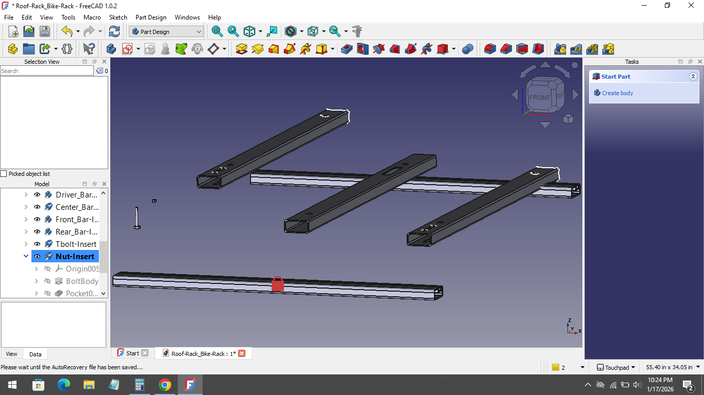

# 2026-06-01 — Exploring Bonded Model

## Objective

Since this assembly is the most complex design I have ever attempted, in either FreeCAD or Inventor. It seems only right that to build understanding I should create simpler "test" assemblies to learn the nuances.

One such area that I want to investigate is the issues that arrise from trying to bond structures/assemblies (beams for ex.) while there is an intentional gap left for tolerance.
Now I know that that tolerences are incorporated into realistic models, I feel I need to understand the basics before bridging the gap between Simplified bonded model -- > Realistic assembly model. 

---

  

