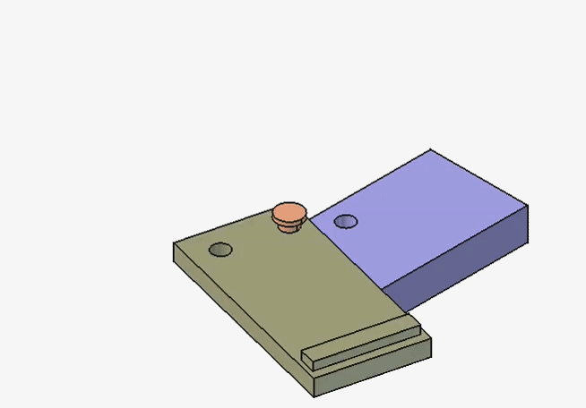

# 2026-06-28-material-properties-test.md

## Updates and Issues

 
Test Model Description:  
Number of Parts:- 3  
Materials:- PVC-Generic (Plank01), ABS-Generic (Plank02), Aluminum-Generic  (Dowell)
 

 
Mesh Parameters
Element Dimensions: 3D  
Element Order: 2nd  
Maximum Size: 0.5 in  
Minimum Size: 0.0 in 
 

 
Preparation finished  
Start process...  
Warning : Volume mesh: worst distortion = -0.316028 (avg = 0.99022, 1 elements with jac. < 0)  
Warning : ------------------------------  
Warning : Mesh generation error summary  
Warning :     1 warning  
Warning :     0 errors  
Warning : Check the full log for details  
Warning : ------------------------------  
Process finished  
Time: 2.6 s
 

 
Mesh Parameters  
Element Dimensions: 3D  
Element Order: 2nd  
Maximum Size: 0.3 in  
Minimum Size: 0.0 in
 

 
Prepare process...  
Preparation finished  
Start process...  
Process finished  
Time: 5.8 s 
 

 
Compounding the assembly seems to be the right move over boolean union, but tolerances are now an issue.  

Since separate parts are needed for assigned material properties, the assembly cannot be fused together. Fusing them together (union) would be much easier, as this simplifies the mesh but reduces the complexity allowed assembly/simulation-wise.  

More on the meshing of compounds: where my issues of tolerances come in is with the decision and understanding of how the mesh/elements will react to part geometries coming into exact contact (0.0 gap).  

The reason for wanting to gain a greater understanding of this is because it could help immensely in the simulation of the bike rack assembly/simulation.  

With only 3 parts, 3 materials, and 2 constraints (fixed & force), this should be a relatively simple model to run analysis on. Certain problems that have arisen are jacobena value <= 0 (Gmsh), tetrahedron = 0 (Netgen), and general FEA workflow troubles.  

 
Bellow is from CalculiX trying to run, but instead throwing a related error to getting elements for solving.  
21:19:27   
21:19:27  Check prerequisites...  
21:19:27   
21:19:27  Get mesh data for constraints, materials and element geometry...  
21:19:27  Materials  
21:19:27  Constraint: MaterialSolid --> We have mesh groups. We will search for appropriate group data.  
21:19:27  Constraint: MaterialSolid001 --> We have mesh groups. We will search for appropriate group data.  
21:19:27  Constraint: MaterialSolid002 --> We have mesh groups. We will search for appropriate group data.  
21:19:27  Count finite elements as sum of constraints:   0  
21:19:27  Count finite elements of the finite element mesh: 24608  
21:19:27  ERROR: femelement_table != count_femelements  
21:19:27  Error in get_femelement_sets_from_group_data -- > femelements_count_ok() failed!  
21:19:27  False  
21:19:27  Constraint: MaterialSolid --> We're going to search in the mesh for the element ID's.  
21:19:27      ReferenceShape ... Type: Solid, Object name: Compound, Object label: Compound, Element name: Solid1  
21:19:27  binary search: get_femelements_by_femnodes_bin  
21:19:27  len femnodes_ele_table: 41850  
21:19:27  found Volumes: 15291  
21:19:27  Constraint: MaterialSolid001 --> We're going to search in the mesh for the element ID's.  
21:19:27      ReferenceShape ... Type: Solid, Object name: Compound, Object label: Compound, Element name: Solid3  
21:19:27  binary search: get_femelements_by_femnodes_bin  
21:19:27  len femnodes_ele_table: 41850  
21:19:27  found Volumes: 8228  
21:19:27  Constraint: MaterialSolid002 --> We're going to search in the mesh for the element ID's.  
21:19:27      ReferenceShape ... Type: Solid, Object name: Compound, Object label: Compound, Element name: Solid2  
21:19:27  binary search: get_femelements_by_femnodes_bin  
21:19:27  len femnodes_ele_table: 41850  
21:19:27  found Volumes: 1089  
21:19:27  Count finite elements as sum of constraints:   24608  
21:19:27  Count finite elements of the finite element mesh: 24608  
21:19:27  ConstraintFixed:  
21:19:27      Type: Fem::ConstraintFixed, Name: ConstraintFixed  
21:19:27      ReferenceShape ... Type: Face, Object name: Compound, Object label: Compound, Element name: Face2  
21:19:27  ConstraintForce:  
21:19:27      Type: Fem::ConstraintForce, Name: ConstraintForce  
21:19:27      ReferenceShape ... Type: Face, Object name: Compound, Object label: Compound, Element name: Face26  
21:19:27  Getting mesh data time: 200.469 seconds.  
21:19:27   
21:19:27  CalculiX solver input writing...  
21:19:27  Input file:C:\Users\cmcka\AppData\Local\Temp\fcfem_zk5iif48\FEMMeshGmsh.inp  
21:19:27  One monster input file.  
21:19:27  Writing time CalculiX input file: 0.797 seconds.  
 

---

  

  

  

