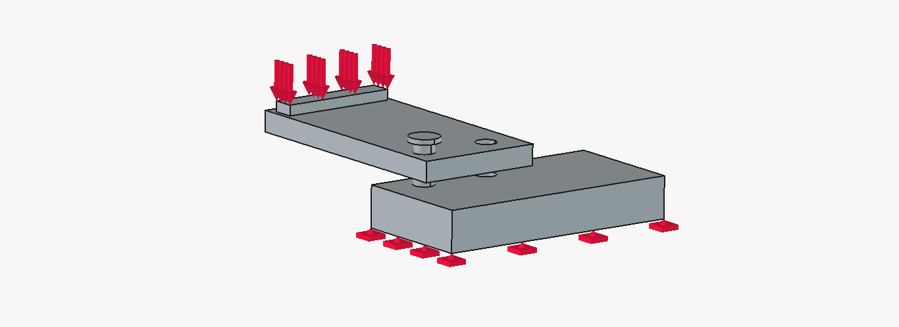
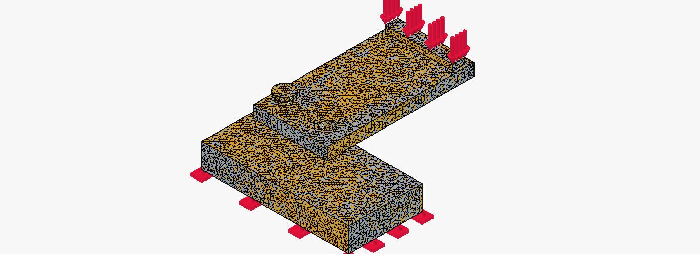

# 2026-06-28-material-properties-test.md

## Updates and Issues

Test Model Description:
Number of Parts:- 3
Materials:- PVC-Generic (Plank01), ABS-Generic (Plank02), Aluminum-Generic  (Dowell)

Mesh Parameters
Element Dimensions: 3D
Element Order: 2nd
Maximum Size: 0.5 in
Minimum Size: 0.0 in

Preparation finished
Start process...
Warning : Volume mesh: worst distortion = -0.316028 (avg = 0.99022, 1 elements with jac. < 0)
Warning : ------------------------------
Warning : Mesh generation error summary
Warning :     1 warning
Warning :     0 errors
Warning : Check the full log for details
Warning : ------------------------------
Process finished
Time: 2.6 s

Mesh Parameters
Element Dimensions: 3D
Element Order: 2nd
Maximum Size: 0.3 in
Minimum Size: 0.0 in

Prepare process...
Preparation finished
Start process...
Process finished
Time: 5.8 s

Compounding the assembly seems to be the right move over boolean union, but tolerances are now an issue.

Since separate parts are needed for assigned material properties, the assembly cannot be fused together. Fusing them together (union) would be much easier, as this simplifies the mesh but reduces the complexity allowed assembly/simulation-wise.

More on the meshing of compounds: where my issues of tolerances come in is with the decision and understanding of how the mesh/elements will react to part geometries coming into exact contact (0.0 gap).

The reason for wanting to gain a greater understanding of this is because it could help immensely in the simulation of the bike rack assembly/simulation. 

With only 3 parts, 3 materials, and 2 constraints (fixed & force), this should be a relatively simple model to run analysis on. Certain problems that have arisen are jacobena value <= 0 (Gmsh), tetrahedron = 0 (Netgen), and general FEA workflow troubles.

Bellow is from CalculiX trying to run, but instead throwing a related error to getting elements for solving.
21:19:27  
21:19:27  Check prerequisites...
21:19:27  
21:19:27  Get mesh data for constraints, materials and element geometry...
21:19:27  Materials
21:19:27  Constraint: MaterialSolid --> We have mesh groups. We will search for appropriate group data.
21:19:27  Constraint: MaterialSolid001 --> We have mesh groups. We will search for appropriate group data.
21:19:27  Constraint: MaterialSolid002 --> We have mesh groups. We will search for appropriate group data.
21:19:27  Count finite elements as sum of constraints:   0
21:19:27  Count finite elements of the finite element mesh: 24608
21:19:27  ERROR: femelement_table != count_femelements
21:19:27  Error in get_femelement_sets_from_group_data -- > femelements_count_ok() failed!
21:19:27  False
21:19:27  Constraint: MaterialSolid --> We're going to search in the mesh for the element ID's.
21:19:27      ReferenceShape ... Type: Solid, Object name: Compound, Object label: Compound, Element name: Solid1
21:19:27  binary search: get_femelements_by_femnodes_bin
21:19:27  len femnodes_ele_table: 41850
21:19:27  found Volumes: 15291
21:19:27  Constraint: MaterialSolid001 --> We're going to search in the mesh for the element ID's.
21:19:27      ReferenceShape ... Type: Solid, Object name: Compound, Object label: Compound, Element name: Solid3
21:19:27  binary search: get_femelements_by_femnodes_bin
21:19:27  len femnodes_ele_table: 41850
21:19:27  found Volumes: 8228
21:19:27  Constraint: MaterialSolid002 --> We're going to search in the mesh for the element ID's.
21:19:27      ReferenceShape ... Type: Solid, Object name: Compound, Object label: Compound, Element name: Solid2
21:19:27  binary search: get_femelements_by_femnodes_bin
21:19:27  len femnodes_ele_table: 41850
21:19:27  found Volumes: 1089
21:19:27  Count finite elements as sum of constraints:   24608
21:19:27  Count finite elements of the finite element mesh: 24608
21:19:27  ConstraintFixed:
21:19:27      Type: Fem::ConstraintFixed, Name: ConstraintFixed
21:19:27      ReferenceShape ... Type: Face, Object name: Compound, Object label: Compound, Element name: Face2
21:19:27  ConstraintForce:
21:19:27      Type: Fem::ConstraintForce, Name: ConstraintForce
21:19:27      ReferenceShape ... Type: Face, Object name: Compound, Object label: Compound, Element name: Face26
21:19:27  Getting mesh data time: 200.469 seconds.
21:19:27  
21:19:27  CalculiX solver input writing...
21:19:27  Input file:C:\Users\cmcka\AppData\Local\Temp\fcfem_zk5iif48\FEMMeshGmsh.inp
21:19:27  One monster input file.
21:19:27  Writing time CalculiX input file: 0.797 seconds.

---

  

  

